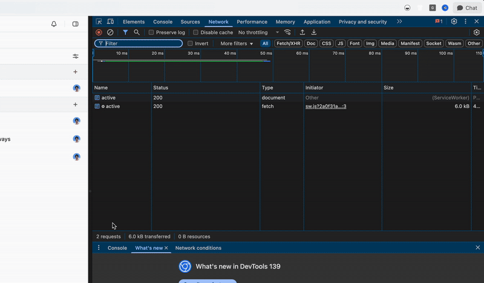
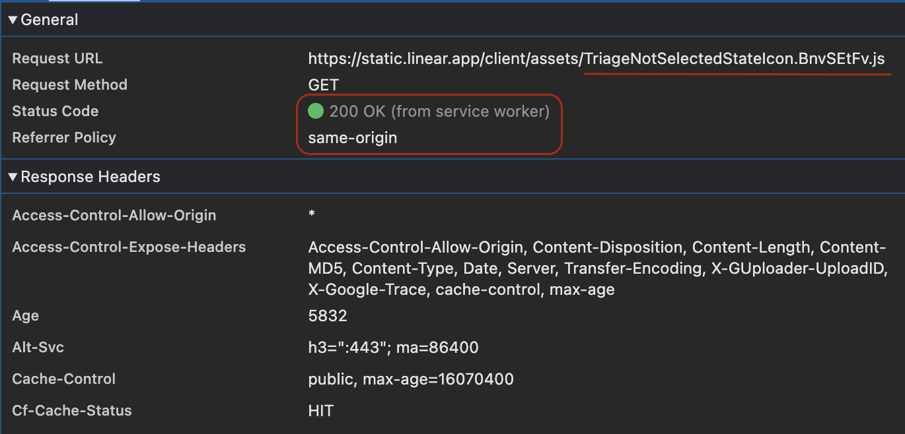

# Native web application

I was inspired by how linear.app was able to feel native and has killer offline support.

On 8th September 2025, I decided to take a look under the hood.

I knew how their infamous [sync engine](https://www.youtube.com/watch?v=bnOpm3a1fRE) works. TL;DR - it stores the recent data in IndexDB. But, I was more interested in finding how the application navigates between pages & is able to work offline effortlessly.

They leverage two clever techniques:

## Greedy First Load

The first page is loaded as is, although every single page after that is greedily preloaded. It does increase first load time, although for an application like Linear, that's a workable tradeoff.

Especially, combined with the next step.

## JS Chunk Cache

They use a clever technique where they store even their chunked javascript bundles in the service worker. Given that it'll rarely change unless there are updates, this is pretty smart.

## Recreation

Based on this recreation, I have created a project which combines tanstack and workbox to achive similar functionality.

Deployed version is available here:

[native-web-application.advaitb.com](https://native-web-application.advaitb.com)
